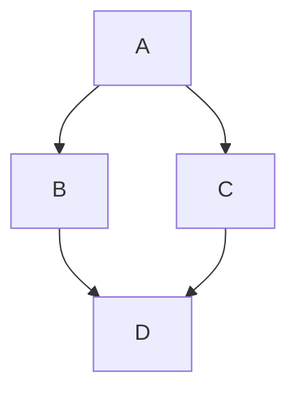
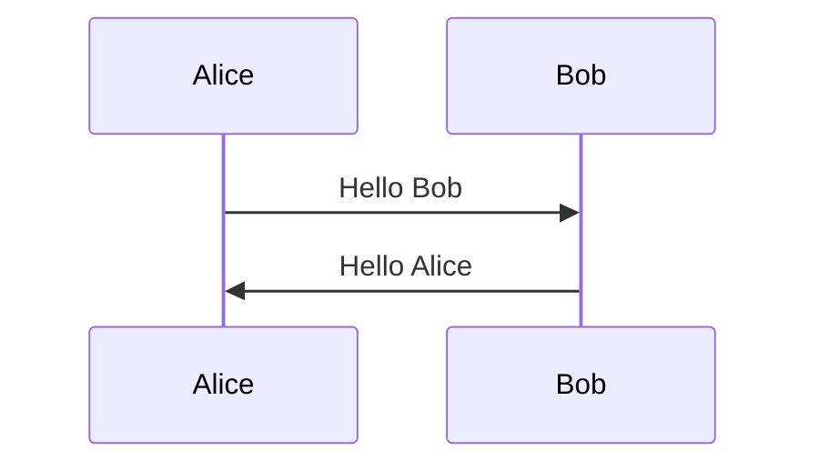

# Mermaid Diagrams

A simple flowchart:

```mermaid
graph TD;
    A-->B;
    A-->C;
    B-->D;
    C-->D;
```

A sequence diagram:

```mermaid
sequenceDiagram
    participant Alice
    participant Bob
    Alice->>Bob: Hello Bob
    Bob->>Alice: Hello Alice
```
